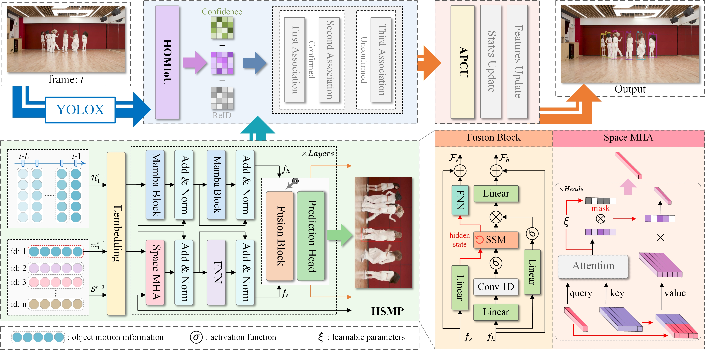

# PE-Track

## :mag_right: PE-Track: Towards Holistic Motion Prediction Enhancement for Multiple Object Tracking

**PE-Track is a holistically motion prediction enhanced tracker.**

### Framework

<center>

</center>
## :fire: News

## :dart: Benchmark Performance

### Tracking results of PE-Track on test sets

|  Dataset   | HOTA | IDF1 | AssA | MOTA | DetA |                           Results                            |
| :--------: | :--: | :--: | :--: | :--: | :--: | :----------------------------------------------------------: |
| DanceTrack | 62.7 | 63.9 | 47.7 | 92.6 | 82.6 | [DanceTrack-results](https://drive.google.com/drive/folders/1OyLgymdcm6aGH-I5hH5m_clDbOMJlWhT) |
| SportsMOT  | 75.0 | 75.4 | 63.4 | 96.8 | 88.8 | [SportsMOT-results](https://drive.google.com/drive/folders/1OyLgymdcm6aGH-I5hH5m_clDbOMJlWhT) |
|   MOT17    | 62.7 | 76.4 | 62.0 | 78.8 | 63.8 | [MOT17-results](https://drive.google.com/drive/folders/1OyLgymdcm6aGH-I5hH5m_clDbOMJlWhT) |
|   MOT20    | 60.5 | 74.0 | 60.2 | 74.2 | 61.0 | [MOT20-results](https://drive.google.com/drive/folders/1OyLgymdcm6aGH-I5hH5m_clDbOMJlWhT) |
|   BEE24    | 49.0 | 63.2 | 43.4 | 68.5 | 55.5 | [BEE24-results](https://drive.google.com/drive/folders/1OyLgymdcm6aGH-I5hH5m_clDbOMJlWhT) |

### Tracking results of PE-Track-Reid on test sets

|  Dataset   | HOTA | IDF1 | AssA | MOTA | DetA |                           Results                            |
| :--------: | :--: | :--: | :--: | :--: | :--: | :----------------------------------------------------------: |
| DanceTrack | 65.8 | 68.0 | 52.6 | 92.7 | 82.4 | [DanceTrack-results](https://drive.google.com/drive/folders/1OyLgymdcm6aGH-I5hH5m_clDbOMJlWhT) |
| SportsMOT  | 76.8 | 77.3 | 66.2 | 96.8 | 89.1 | [SportsMOT-results](https://drive.google.com/drive/folders/1OyLgymdcm6aGH-I5hH5m_clDbOMJlWhT) |
|   MOT17    | 63.7 | 78.4 | 63.8 | 78.9 | 63.8 | [MOT17-results](https://drive.google.com/drive/folders/1OyLgymdcm6aGH-I5hH5m_clDbOMJlWhT) |
|   MOT20    | 63.1 | 77.9 | 65.0 | 74.3 | 61.3 | [MOT20-results](https://drive.google.com/drive/folders/1OyLgymdcm6aGH-I5hH5m_clDbOMJlWhT) |
|   BEE24    | 49.4 | 64.0 | 44.1 | 68.5 | 55.5 | [BEE24-results](https://drive.google.com/drive/folders/1OyLgymdcm6aGH-I5hH5m_clDbOMJlWhT) |

### Tracking results of PE-Track on validation sets

|  Dataset   | HOTA | IDF1 | AssA | MOTA | DetA |
| :--------: | :--: | :--: | :--: | :--: | :--: |
| DanceTrack | 60.1 | 62.1 | 46.0 | 90.5 | 78.9 |
| SportsMOT  | 77.3 | 79.3 | 68.0 | 95.5 | 88.0 |
|   MOT17    | 67.8 | 80.1 | 69.9 | 77.6 | 66.3 |

### Tracking results of PE-Track-Reid on validation sets

|  Dataset   | HOTA | IDF1 | AssA | MOTA | DetA |
| :--------: | :--: | :--: | :--: | :--: | :--: |
| DanceTrack | 62.9 | 65.6 | 49.8 | 90.7 | 79.8 |
| SportsMOT  | 79.8 | 82.2 | 72.2 | 95.5 | 88.3 |
|   MOT17    | 68.9 | 81.5 | 71.7 | 77.9 | 66.8 |

## :wrench: I. Installation

- Initialize the environment

```
conda create -n PE-Track python=3.10.13
conda activate PE-Track
conda install pytorch==2.1.1 torchvision==0.16.1 torchaudio==2.1.1 pytorch-cuda=11.8 -c pytorch -c nvidia
```

install mamba-ssm == 1.2.0.post1, triton == 2.1.0 and causal-conv1d1.2.1. You can compile [mamba-ssm](https://github.com/state-spaces/mamba/tree/v1.2.0.post1) and [causal-conv1d](https://github.com/Dao-AILab/causal-conv1d) from their official source code. We recommend using the offline .whl installation files, which can be found in the link above. We also provide the corresponding [version](https://drive.google.com/drive/folders/1JkkFj5UMAdv-sKAVo-S5PqoZoeHRYaW6).

- install other packages

```
pip install -r requirement.txt
```

**Note:** adjust numpy==1.23.5

- install external dependencies

```
cd external/YOLOX/
pip install -r requirements.txt && python setup.py develop
cd ../external/deep-person-reid/
pip install -r requirements.txt && python setup.py develop
cd ../external/fast_reid/
pip install -r docs/requirements.txtData preparation
```

## :pushpin: II. Data Preparation

Our data structure is as follows:

```
<Root>/Datasets
|-- DanceTrack
|	|-- test
|	|-- val
|	|-- train
|	|-- test_seqmap.txt
|	|-- val_seqmap.txt
|	|-- train_seqmap.txt
|
|-- sportsmot_publish
|	|-- dataset
|	|	|-- test
|	|	|-- val
|	|	|-- train
|	|-- scripts
|	|	|-- ...
|	|-- splits_txt
|	|	|-- test.txt
|	|	|-- val.txt
|	|	|-- train.txt
|	|	|-- ...
|
|-- MOT17
|	|-- test
|	|-- train
|	|-- test_seqmap.txt
|	|-- train_seqmap.txt
|
|-- MOT20
|	|-- test
|	|-- train
|
|-- BEE24
|	|-- test
|	|-- train
|	|-- test_seqmap.txt
```

1. Download these datasets from [DanceTrack](https://github.com/DanceTrack/DanceTrack?tab=readme-ov-file), [SportsMOT](https://codalab.lisn.upsaclay.fr/competitions/12424#participate), [MOT17](https://motchallenge.net/data/MOT17/), [MOT20](https://motchallenge.net/data/MOT20/) and [BEE24](https://holmescao.github.io/datasets/BEE24) respectively. Then put them under  `<Root>/Datasets` according to the above structure.

2. Process the MOT17 dataset:


```
python data_process/MOT17/convert_mot17_to_coco.py
```

**Note:** Some data sets are missing information and need to be filled in manually.

## :cloud: III. Model Zoo

### Detection model

We provide some trained YOLOX weights in [Download](https://drive.google.com/drive/folders/1lY12VIN4sxlbbqzLD7Uy_LGx8WjwMGGg) for PE-Track. They are inherited from from [ByteTrack](https://github.com/ifzhang/ByteTrack#model-zoo), [DanceTrack](https://github.com/DanceTrack/DanceTrack#evaluation), [MixSort](https://github.com/MCG-NJU/MixSort#model-zoo) and [TOPICTrack](https://github.com/holmescao/TOPICTrack). After downloading, put them under `<Root>/external/weights`.

If you want to train a detector yourself, you can refer to [ByteTrack](https://github.com/ifzhang/ByteTrack) or [HybridSORT](https://github.com/ymzis69/HybridSORT).

### ReID model

Ours ReID models for **MOT17/MOT20** is the same as [BoT-SORT](https://github.com/NirAharon/BOT-SORT) , you can download from [MOT17/MOT20-SBS-S50](https://drive.google.com/drive/folders/1lY12VIN4sxlbbqzLD7Uy_LGx8WjwMGGg). The ReID model for **DanceTrack** is the same as [HybridSORT](https://github.com/ymzis69/HybridSORT), you can download from [DanceTrack-SBS-S50](https://drive.google.com/drive/folders/1lY12VIN4sxlbbqzLD7Uy_LGx8WjwMGGg). The ReID model for **SportsMOT** is  the same as [DiffMOT](https://github.com/Kroery/DiffMOT), you can download from [SportsMOT-SBS-S50](https://drive.google.com/drive/folders/1lY12VIN4sxlbbqzLD7Uy_LGx8WjwMGGg). The ReID model for **BEE24** is  the same as [TOPICTrack](https://github.com/holmescao/TOPICTrack), you can download from [BEE24-SBS-S50](https://drive.google.com/drive/folders/1lY12VIN4sxlbbqzLD7Uy_LGx8WjwMGGg). After downloading, put them under `<Root>/external/weights`.

### Motion predictor (HSMP)

We provide trained HSMP weights, which you can get from [Weights](https://drive.google.com/drive/folders/1-hNmP_qANqx22gsDeE5Tn91fuPb25BKl). You can also train them by yourself, following the next section.

## :rocket: IV. Training

### Sample tracklet segments

The default sampling length for all datasets is 5.

```
# DanceTrack:
python data_process/DanceTrack/dancetrack_data_process.py
# SportsMOT:
python data_process/SportsMOT/sportsmot_data_process.py
# MOT17:
python data_process/MOT17/mot17_data_process.py
# MOT20:
python data_process/MOT20/mot20_data_process.py
# BEE24:
python data_process/BEE24/bee24_data_process.py
```

`mot17_train_half_5.pkl` is sampled from the first half of the **MOT17** train set, while `mot17_val_half_5.pkl` is sampled from the latter half.

We provide sampled data, you can download them from [Sample](https://drive.google.com/drive/folders/1wFbmijwmo3JinQRvtbTnjDFey3AknUaI?usp=drive_link).

### Train the motion predictor (HSMP)

> train HSMP on DanceTrack

```
python train.py --config configs/DanceTrack/dance_train.yaml --device 0
```

> train HSMP on SportsMOT

```
python train.py --config configs/SportsMOT/sports_train.yaml --device 0
```

> train HSMP on MOT17

```
python train.py --config configs/MOT17/mot17_train.yaml --device 0
```

For verifying PE-Track locally, we train HSMP on `mot17_train_half_5.pkl`. Therefore, you need to modify the configuration file `mot17_train.yaml` as follows:

- `data_path`: ~~"sample_datasets/MOT17/mot17_train_5.pkl"~~   **--->**   "sample_datasets/MOT17/mot17_train_half_5.pkl"
- Don't forget to change the save path: `save_dir`


> train HSMP on MOT20

```
python train.py --config configs/MOT20/mot20_train.yaml --device 0
```

> train HSMP on BEE24

```
python train.py --config configs/BEE24/bee24_train.yaml --device 0
```

## :star2: V. Tracking

We provide pre-trained HSMP [Weights](https://drive.google.com/drive/folders/1-hNmP_qANqx22gsDeE5Tn91fuPb25BKl). You can download them and put them into `<Root>/models/weights`. When you use your own trained weights, please modify the `weight_path: <your weight path>` in the configuration file `.yaml`.

If you don't want to run the detection and feature extraction networks, we provide caches of them that you can download from [Caches](https://drive.google.com/drive/folders/1K0i5NjtzeGbUC0AK-06a4MW422if87UE?usp=drive_link). Then you need to put them into `<Root>/cache`. If you don't want to use the cache, modify the configuration file `.yaml` as follows:

- `use_cache`: ~~True~~   **--->**   False

- set your own cache path: `save_cache_path`

### Track on DanceTrack

> Track on DanceTrack test set:

```
python main.py --config configs/DanceTrack/dace_test.yaml --device 0
```

> Track on DanceTrack validation set:

```
python main.py --config configs/DanceTrack/dace_val.yaml --device 0
```

### Track on SportsMOT

> Track on SportsMOT test set:

```
python main.py --config configs/SportsMOT/sports_test.yaml --device 0
```

> Track on SportsMOT validation set:

```
python main.py --config configs/SportsMOT/sports_val.yaml --device 0
```

### Track on MOT17

Modify the `matching.py` file: comment out lines 148-149 and uncomment lines 151-152.

> Track on MOT17 test set:

```
python main.py --config configs/MOT17/mot17_test.yaml --device 0
```

> Track on MOT17 val_half set:

```
python main.py --config configs/MOT17/mot17_val.yaml --device 0
```

### Track on MOT20

> Track on MOT20 test set:

```
python main.py --config configs/MOT20/mot20_test.yaml --device 0
```

### Track on BEE24

> Track on BEE24 test set:

```
python main.py --config configs/BEE24/bee24_test.yaml --device 0
```

**Note**: if you do not want to use appearance features during tracking, you need to modify the configuration file `.yaml` as follows:

- `tracker`: ~~"PE-Track-Reid"~~   --->   "PE-Track"

## :boom: VI. Demo

<center>
<video autoplay controls muted loop playsinline width="800">
<source src="assets/compare_demo.mp4" type="video/mp4">
</video>
</center>

## :round_pushpin: Acknowledgement

Some of our code is borrowed from [DiffMOT](https://github.com/Kroery/DiffMOT) and [StrongSORT](https://github.com/dyhBUPT/StrongSORT). Thanks for their wonderful works.

## :link: Citation

```
Citation information will be updated later
```


